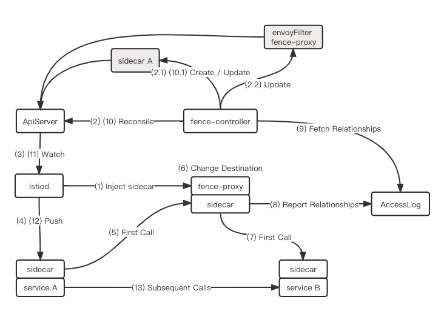
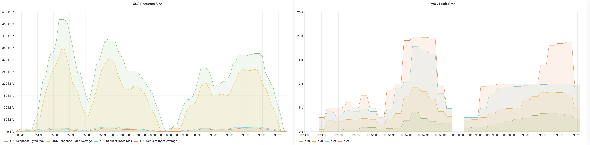
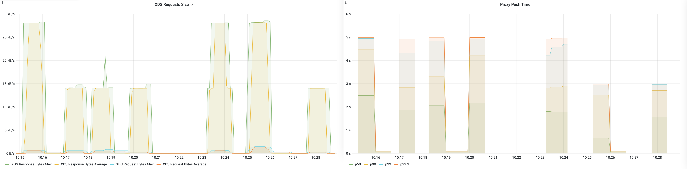

# Fence（[中文](./README.zh-CN.md)）

Fence is an open source project to automate the management of Istio custom resources `Sidecar`.

## Backgroud

When there are too many services in the Service Grid, the Envoy configuration is too large and new applications remain in Not Ready state for a long time. For this reason, Ops needs to manage the custom resource `Sidecar` and manually configure service dependencies for the application.

Fence has the ability to automatically fetch service dependencies and provide automatic management of the custom resource `Sidecar`.

## Architecture



## Performance Indicator

In a Kubenetes cluster with 250 pods, the `XDS Response Bytes Max` peaks at 450 kB/s and the `Proxy Push Time` peaks at 20s before Fence is enabled, and the `XDS Response Bytes Max` peaks at 27 kB/s and the `Proxy Push Time` peaks at 5s after Fence is enabled. In summary, enabling Fence to automatically manage Sidecar resources reduces the `XDS Response Bytes Max` peak by about 94% and the `Proxy Push Time` peak by about 75%.

**Before Fence is enabled**



**After Fence is enabled**



## Install & Use

**Use kubectl**

```shell
kubectl create namespace fence
kubectl apply -f "https://raw.githubusercontent.com/hexiaodai/fence/0.1.0/deploy/fence.yaml"
```

**Use helm**

```shell
helm install fence --create-namespace -n fence oci://registry-1.docker.io/hejianmin/chart-fence --version 0.1.0
```

**Fence has two ways to automate the management of custom resource Sidecars in a cluster:**

> Note: Fence does not manage Sidecar in the system namespace `kube-system`, `istio-system`.

- Manage the entire cluster, this is the default behavior

```shell
kubectl -n fence set env deployment/fence AUTO_FENCE="true"
```

- Specify a Namespace or Pod to manage

```shell
kubectl -n fence set env deployment/fence AUTO_FENCE="false"
# Namespace
kubectl label namespace ${namespace name} sidecar.fence.io=enabled
# Pod
kubectl label pods ${pod name} sidecar.fence.io=enabled
```

- Specify a Namespace or Pod that does not need to be managed

```shell
# Namespace
kubectl label namespace ${namespace name} sidecar.fence.io=disable
# Pod
kubectl label pods ${pod name} sidecar.fence.io=disable
```
