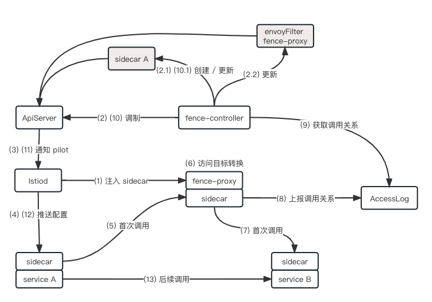

# Fence

Fence 是一个开源项目，用于自动管理自定义资源 `Sidecar`。

## 背景

服务网格内服务数量过多时，Envoy 配置量太大，新上的应用长时间处于 Not Ready 状态。为此运维人员需要管理自定义资源 `Sidecar`，手动为应用配置服务依赖关系。

Fence 拥有自动获取服务依赖关系的能力，提供自动管理自定义资源 `Sidecar`。

## 架构



## 安装

```shell
kubectl create namespace fence

kubectl apply -f "https://raw.githubusercontent.com/hexiaodai/fence/main/deploy/fence.yaml"
```

## 指南

Fence 有两种自动管理集群中自定义资源 Sidecar 的方式：

- 管理整个集群，这是默认行为

```shell
kubectl -n fence set env deployment/fence AUTO_FENCE="true"
```

- 指定需要管理的名称空间、Pod

```shell
kubectl -n fence set env deployment/fence AUTO_FENCE="false"

# 名称空间
kubectl label namespace -l sidecar.fence.io=enabled

# Pod
kubectl label pods -l sidecar.fence.io=enabled
```

> 注意：Fence 不会管理系统名称空间 `kube-system`、`istio-system` 下的 Sidecar

指定不需要管理的名称空间、Pod

```shell
# 名称空间
kubectl label namespace -l sidecar.fence.io=disable

# Pod
kubectl label pods -l sidecar.fence.io=disable
```
